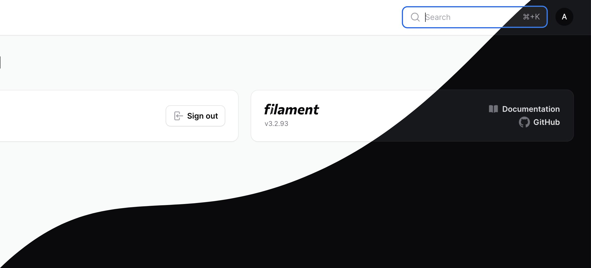
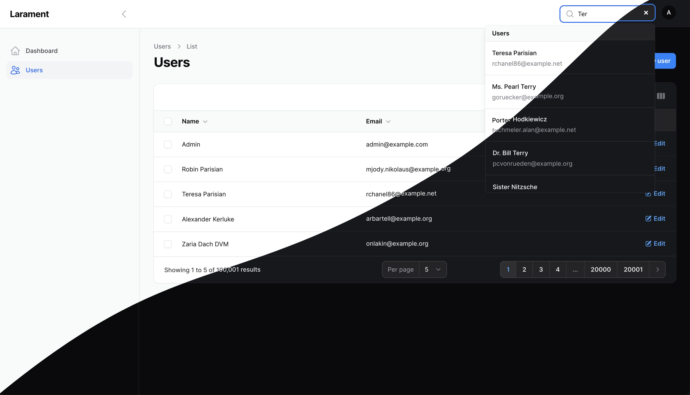

# Larament
Kickstart your project and save time with Larament! This time-saving starter kit includes a Laravel project with FilamentPHP already installed and set up, along with extra features.

> [!NOTE]
> This starter kit includes **Laravel 11** and **FilamentPHP 3** with some packages that improve the development experience. This will not contain any bloated features or unnecessary packages. If you want to add more features, you can do so by installing the necessary packages. 


## Installation

**[Use this template](https://github.com/new?template_name=larament&template_owner=CodeWithDennis)** to create a new repository and clone it to your local machine, then navigate to the project directory to run the necessary commands.

```bash
composer install
npm install && npm run build
cp .env.example .env
php artisan key:generate
```
Since [Laravel 11](https://laravel.com/docs/11.x/releases#application-defaults) the default database is SQLite, if you want to use another database, update the `.env` file with your database preferences before running the migrations.

```bash
php artisan migrate --seed
```

## Filament

### Panel Color
The primary color for the Filament Panel is set to `Color::Blue`.

### SPA
[SPA](https://filamentphp.com/docs/3.x/panels/configuration#spa-mode) (Single Page Application) is enabled by default.

### Login
A custom login page that **automatically** fills in the email and password fields with seeded data, making it easy to test locally without entering credentials. You can find the custom login page in the [App\Filament\Pages\Auth](https://github.com/CodeWithDennis/larament/blob/main/app/Filament/Pages/Auth/Login.php) directory.


### Global Search Keybinding

The global search keybinding is set to `CTRL + K` or `CMD + K` for macOS by default.



### UserResource PEST Tests
A test file for the UserResource that tests all functionalities. You can find the test file in the [tests/Feature/Filament/Resources](https://github.com/CodeWithDennis/larament/blob/main/tests/Feature/Filament/Resources/UserResourceTest.php) directory.


### User Global Search
A global search for users that contains the email in the search results.



### Generate Password
A custom action for generating passwords on the user's profile page and user resource. You can find the action in the [App\Filament\Actions](https://github.com/CodeWithDennis/larament/blob/main/app/Filament/Actions/GeneratePasswordAction.php) directory.

### Profile
A custom profile page that uses the generated password action. You can find the profile page in the [App\Filament\Pages\App](https://github.com/CodeWithDennis/larament/blob/main/app/Filament/Pages/App/Profile.php) directory.


### Theme
A [custom theme](https://filamentphp.com/docs/3.x/panels/themes#creating-a-custom-theme) that is ready to be used which includes a sidebar separator. You can find the theme stylesheet in the [resources/css/filament/admin](https://github.com/CodeWithDennis/larament/blob/main/resources/css/filament/admin/theme.css) directory.

### Globally Translated Labels
All components are automatically translatable this means that you do not need to add `->translatable()` or `__()` to your components. If you want to disable this feature, you can remove the following code from the `AppServiceProvider.php`.

```php
public function boot(): void
{
    foreach ([Field::class, BaseFilter::class, Placeholder::class, Column::class, Entry::class] as $component) {
        /* @var Configurable $component */
        $component::configureUsing(function (Component $translatable): void {
            $translatable->translateLabel();
        });
    }
}
```

## Packages

### [timokoerber/laravel-one-time-operations](https://github.com/TimoKoerber/laravel-one-time-operations)
This package allows you to run one-time operations in your Laravel application. Instead of adding a new migration for a simple task, you can use this package to run the operation only once.

### [barryvdh/laravel-debugbar](https://github.com/barryvdh/laravel-debugbar)
This package provides a developer toolbar for debugging Laravel applications. It includes a lot of helpful information like queries, routes, views, and more.

> This package is only installed in the development environment.

> [!NOTE]
> Keep in mind that the debugbar views collector might slow down your application due to view rendering, but you can turn it off in the debugbar config file if you don't need it.

### [pestphp/pest](https://pestphp.com/docs/installation)
Pest is a testing framework with a focus on simplicity, meticulously designed to bring back the joy of testing in PHP.

> This package is only installed in the development environment.

#### Additional Plugins
- [pestphp/pest-plugin-faker](https://pestphp.com/docs/plugins#faker) 
- [pestphp/pest-plugin-laravel](https://pestphp.com/docs/plugins#laravel)
- [pestphp/pest-plugin-livewire](https://pestphp.com/docs/plugins#livewire)

## Boilerplate
The following files are part of the "branding" and can be removed.
- resources/images/larament.png
- resources/images/login.png
- resources/images/user-global-search.jpg
- resources/images/user-resource-pest.png
- resources/images/generate-password-action.jpg
